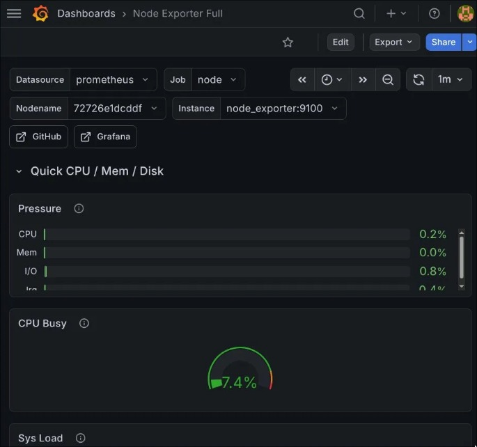
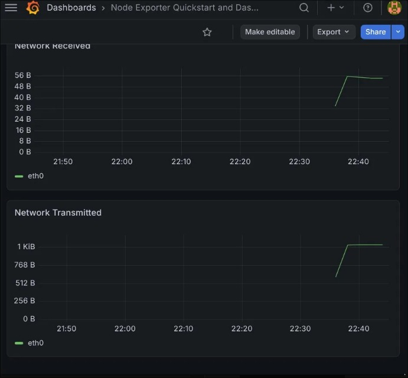
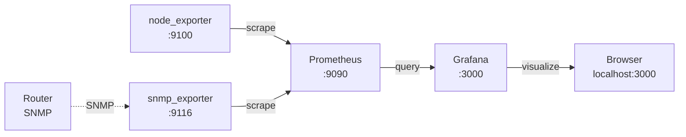

# 📊 Network Dashboard

> Real-time network and system monitoring with Grafana, Prometheus and Docker — running on Arch Linux.


---

## Overview

**Network Dashboard** is a homelab monitoring stack that collects and visualizes system and network metrics in real time. It runs entirely via Docker Compose and provides:

- **CPU, memory, disk and I/O** metrics from the host machine
- **Network traffic** (bytes received/transmitted per interface)
- **Time-series storage** with 15-second scrape intervals
- **Visual dashboards** accessible from any browser on the local network

---

## Screenshots

### System metrics — CPU, memory, I/O pressure


### Network traffic — bytes received and transmitted


---

## Architecture



---

## Stack

| Service | Image | Port | Purpose |
|---------|-------|------|---------|
| Prometheus | `prom/prometheus` | 9090 | Metrics collection and storage |
| node_exporter | `prom/node-exporter` | 9100 | Host system metrics |
| snmp_exporter | `prom/snmp-exporter` | 9116 | Router metrics via SNMP |
| Grafana | `grafana/grafana` | 3000 | Visualization dashboards |

---

## Requirements

- Docker
- Docker Compose
- Arch Linux (or any Linux distro with kernel modules `ip_tables`, `br_netfilter`, `overlay`)

### Kernel modules (Arch Linux)

On Arch Linux with recent kernels, load the required modules before starting Docker:

```bash
sudo modprobe ip_tables
sudo modprobe iptable_nat
sudo modprobe iptable_filter
sudo modprobe br_netfilter
sudo modprobe overlay
```

To load them automatically on every boot:

```bash
sudo nano /etc/modules-load.d/docker.conf
```

```
ip_tables
iptable_nat
iptable_filter
br_netfilter
overlay
```

---

## Setup

### 1. Clone the repository

```bash
git clone https://github.com/YOUR_USERNAME/network-dashboard.git
cd network-dashboard
```

### 2. Configure your network range

Edit `prometheus/prometheus.yml` and set your router's IP:

```yaml
- targets: ['192.168.15.1']  # replace with your router's IP
```

Check your network range with:

```bash
ip route
```

### 3. Start the stack

```bash
docker compose up -d
```

Verify all containers are running:

```bash
docker compose ps
```

All four services should show status `running`.

### 4. Configure Grafana

1. Open **[localhost:3000](http://localhost:3000)**
2. Login: `admin` / `homelab123`
3. Go to **Connections → Data sources → Add data source**
4. Select **Prometheus**
5. Set URL to `http://prometheus:9090`
6. Click **Save & test** — should show `Successfully queried the Prometheus API`

### 5. Import dashboards

**System metrics (CPU, RAM, disk):**
1. Go to **Dashboards → Import**
2. Enter ID `1860`
3. Select Prometheus as data source
4. Click **Import**

**Network traffic:**
1. Go to **Dashboards → Import**
2. Enter ID `13978`
3. Select Prometheus as data source
4. Click **Import**

---

## Usage

**Start the stack:**
```bash
docker compose up -d
```

**Stop the stack:**
```bash
docker compose down
```

**View logs:**
```bash
docker compose logs -f
```

**Stop and remove all data:**
```bash
docker compose down -v
```

---

## Troubleshooting

**Docker fails to start on Arch Linux**
> Load the required kernel modules manually: `sudo modprobe ip_tables iptable_nat iptable_filter`. If the module is not found, boot into the LTS kernel: install with `sudo pacman -S linux-lts linux-lts-headers`, then select it in the GRUB menu.

**SNMP timeout from router**
> Some ISP routers (e.g. Vivo Fibra) do not expose SNMP. In this case, the `node_exporter` dashboards still provide full visibility into the host machine's network interfaces.

**Grafana shows no data**
> Confirm the Prometheus data source URL is set to `http://prometheus:9090` (not `localhost`) — services communicate via Docker's internal network using container names.

---

## Skills Demonstrated

- Container orchestration with Docker Compose
- Metrics collection with Prometheus (pull-based model, scrape intervals)
- System observability with node_exporter (CPU, memory, disk, network)
- Network monitoring with snmp_exporter (SNMP protocol)
- Dashboard creation and data source configuration in Grafana
- Linux kernel module management on Arch Linux

---

## Related Projects

This project is part of a homelab cybersecurity portfolio built in preparation for the **MS Cybersécurité des Infrastructures et des Données** at Télécom SudParis.

Other projects in the series:
- [x] Network Watcher — real-time device detection with Telegram alerts
- [x] Network Dashboard — Grafana + Prometheus monitoring stack
- [ ] Secure DNS — Pi-hole with query logging
- [ ] Firewall — nftables with allowlists and block logging
- [ ] IDS — Suricata with port scan detection
- [ ] SIEM — Wazuh for centralized log analysis
- [ ] Honeypot — Cowrie SSH trap

---

## License

MIT
